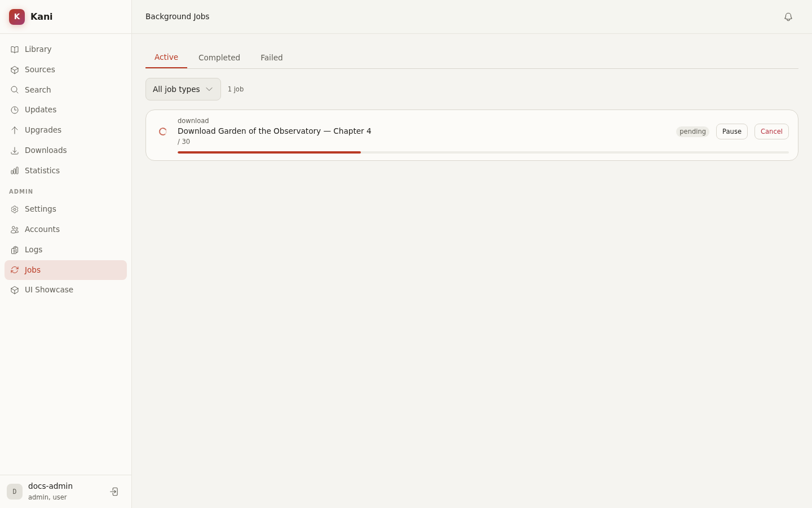

# Jobs and Maintenance

Long-running, retryable, recurring, or deduplicated work runs through Kani's background-job
framework. Examples include downloads, scans, refreshes, tracker sync, webhook delivery, backups,
archive export, storage scrub, thumbnail work, and retention cleanup.

## Jobs page

Open **Jobs** with the `admin:jobs` permission to inspect active, queued, paused, completed, and
failed work. A job records its kind, state, timestamps, progress where available, and final error.

Supported actions depend on state and job kind:

- Pause or resume work that implements pausing.
- Cancel queued or active work.
- Retry a failed operation through the owning feature or job action.
- Follow a submitted backup, scan, export, or maintenance action from its success notification.

Canceling is cooperative. A job may finish its current bounded operation before stopping.

## Recurring work

Recurring jobs are registered by kind and dispatched by the central scheduler. Configure them in
the relevant settings section rather than creating an external cron loop:

- Scans under **Settings → Scan**.
- Scheduled backups under **Settings → Storage**.
- Tracker behavior under **Settings → Trackers**.
- Retention, audit pruning, integrity, thumbnails, and related work under
  **Settings → Maintenance**.

The displayed schedule uses the time zone shown in the interface. Scheduled backup hours use UTC.

## Storage maintenance

Storage jobs can inspect manifests, scrub archives, purge trash, retry pending deletions, backfill
metadata, and maintain thumbnails. Run disruptive or I/O-heavy work during a quiet period and
watch free space while it is active.

Do not manually delete files from the library to imitate a Kani purge. The database, manifests,
and filesystem must move together, and Kani has retry paths for failures such as locked files.

## Shutdown

Kani gives tracked jobs a bounded drain period during graceful shutdown. `KANI_JOB_SHUTDOWN_TIMEOUT_SECONDS`
controls that process-level limit. A clean restart does not guarantee every job finished; inspect
the restored queue after startup.
