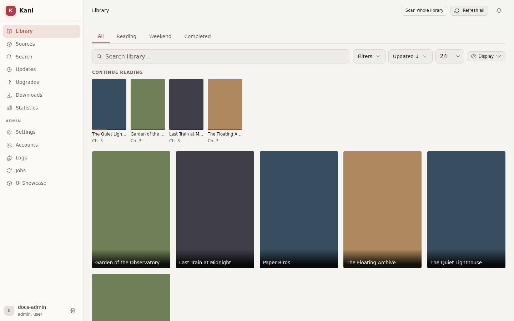
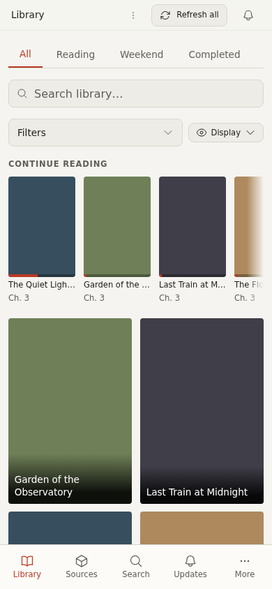

# Library and Discovery

The library is the home screen for titles you follow. Sources remain responsible for remote
browsing and chapter discovery; the library stores the local copy of each followed title and its
per-user state.

## Find and add a title

Use **Search** to search all enabled sources, or open **Sources** and search one source directly.
Open a result to inspect its description and chapters before adding it to the library. If a title
already exists locally, Kani links to the library entry instead of creating another copy.

Adding a title records its source identity and metadata. It does not necessarily download every
chapter. Configure download rules on the manga page or download chapters manually.

## Browse the library

The library supports text search, category tabs, source and status filters, sort order, page size,
and grid-density controls. Filter state is reflected in the URL where appropriate, so a useful
view can be bookmarked.

The continue-reading shelf shows titles with unfinished progress. New-chapter indicators clear
when the corresponding updates are seen; they are separate from chapter read status.

The same controls collapse into a compact toolbar on smaller screens.

## Categories and collections

Categories are explicit labels assigned to titles. Create, rename, order, and remove them under
**Settings → Library**, then assign them from a manga page or the library's bulk-selection bar.
Deleting a category does not delete its manga.

Collections are reusable groupings defined under **Settings → Collections**. Saved searches retain
a set of library filters so it can be reopened without rebuilding the query. Use categories for
curated ownership and saved searches for a dynamic view.

## Bulk actions

Enter bulk-selection mode from the library to assign categories, refresh or scan several titles,
change supported settings, or move titles to trash. Available actions depend on your permissions.
Destructive actions require confirmation.

## Refresh and scan

A refresh asks the source for current metadata or chapters for one title. A library scan submits
background jobs for eligible titles and reports progress through the jobs and notification UI.
Per-title auto-scan and global scan scheduling are configured separately.

If a source is disabled or unavailable, the local library entry and downloaded chapters remain
available. Remote refresh, migration, and missing-page downloads require a working source.

## Remove and restore

Removing a manga moves it to trash rather than immediately deleting all data. Restore or purge it
under **Settings → Trash**. Retention and purge behavior are operator-controlled; downloaded files
may be removed by associated background work rather than synchronously with the button press.

See also [Manga and chapters](manga-chapters.md), [Importing and migration](import-migration.md),
and [Storage](../admin/storage.md).
