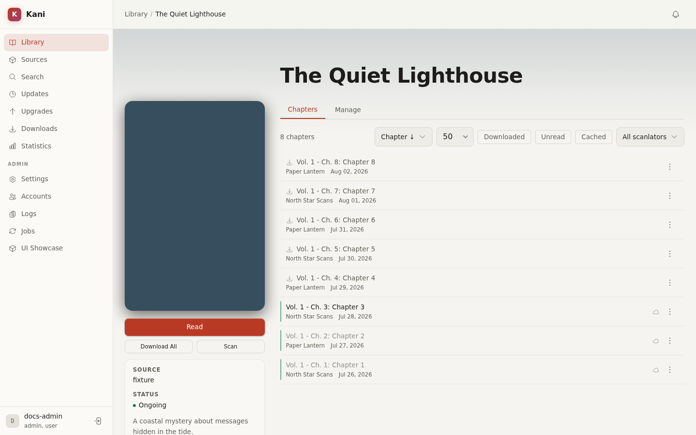

# Manga and Chapters

A manga page combines source metadata, the locally stored chapter list, reading state, download
controls, and per-title automation.

## Metadata and source data

Kani stores the source title, description, authors, artists, tags, status, and cover when a title
is added or refreshed. Local overrides let authorised users replace individual fields without
losing the source value. Clearing an override returns that field to source-managed behavior.

Metadata providers can enrich a title independently from its chapter source when one is installed
and configured. Review the preview before applying enrichment.

## Chapter list

The chapter list can be sorted and paginated according to the source's capabilities. Kani retains
chapter identity so read progress and downloads survive ordinary metadata refreshes. Source
changes can still create replacements or suppressed duplicates; review any notice shown above the
list.

Chapter actions include:

- Mark read or unread, including marking all chapters up to a point.
- Download, retry, cancel, or delete local data.
- Open the reader and resume from stored page progress.
- Add bookmarks and a chapter note.
- Export a downloaded chapter in a supported format.

## Scanlator and language preferences

Global preferences are configured under **Settings → Scanlators**. A manga can override them with
priority or blocking rules. These preferences affect which chapter releases are preferred or
suppressed; they do not rewrite the upstream chapter list.

When several releases represent the same chapter, Kani can offer an upgrade to a preferred
release. Review the candidate before replacing downloaded data, or enable automatic replacement
for that title where appropriate.

## Download rules

Download rules are ordered conditions evaluated against newly discovered chapters. Rules can use
language, scanlator, volume, and other chapter properties, and can be previewed against the current
list before saving. The first matching behavior and the rule-composition mode determine whether a
chapter is queued.

Manual download remains available regardless of whether an automatic rule matches, subject to the
user's permissions and server limits.

## Refresh, scan, and migration

Refresh retrieves source metadata and chapters. Scan is background work used by scheduled and
multi-title workflows. The manga page exposes job progress rather than keeping the request open.

Migration maps the library entry to a result from another installed source. Use the preview to
check title and chapter matching. Kani preserves local metadata and progress where it can; the
preview is the authority for what the selected migration will move or replace.

See [Downloads and exports](downloads-exports.md) and [Importing and migration](import-migration.md).
