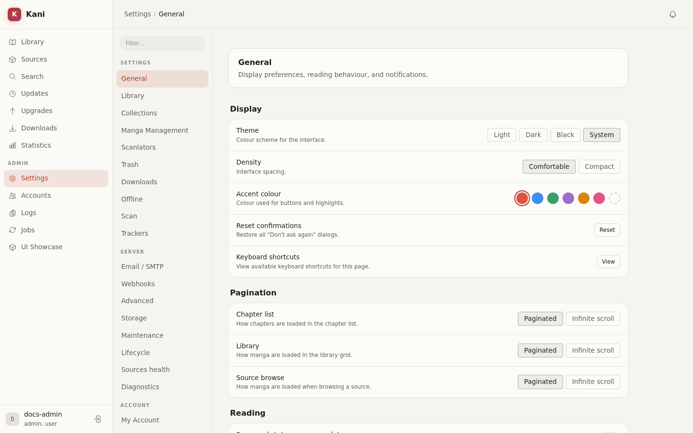

# Settings Guide

Settings are grouped by workflow. Use the search field or command palette to find an individual
control; both search the same section index. Sections are permission-gated, so two accounts can
see different navigation.

This guide explains each section's scope and effects. Refer to the running interface for current
labels, defaults, ranges, and validation.

## Personal and library sections

| Section | Purpose |
|---|---|
| General | Theme, density, language-facing UI preferences, shortcuts, and custom themes |
| Library | Categories plus Kani and Tachiyomi/Mihon import/export workflows |
| Collections | Define reusable library collections |
| Manga management | Pending imports, duplicate review, and orphaned titles |
| Scanlators | Global scanlator priority and blocking preferences |
| Trash | Restore or permanently purge removed manga |
| Downloads | Download concurrency, retry, archive, and rule defaults |
| Offline | Browser-local chapter caching and storage management |
| Scan | Scheduled scans and refresh behavior |
| Trackers | AniList and MyAnimeList credentials, linking, and sync controls |

## Server sections

| Section | Purpose |
|---|---|
| Email | SMTP transport, sender identity, test delivery, and mail-dependent features |
| Webhooks | Endpoints, event selection, secrets, overrides, and delivery history |
| Advanced | Library paths and advanced runtime behavior |
| Storage | Volumes, capacity, archives, and backup scheduling |
| Maintenance | Retention, integrity, thumbnails, and recurring upkeep |
| Server | Registration, update, and server-wide administration |
| Source health | Enabled-source status, circuit breakers, browser support, and reload controls |
| Diagnostics | Database, storage, jobs, bandwidth, browser, errors, and support information |

## Account sections

| Section | Purpose |
|---|---|
| Account | Profile, password, active sessions, and sign-out controls |
| Clients | General API tokens and OPDS reader tokens |
| Security | Two-factor authentication, backup codes, and security state |

## Saving and restart behavior

Sections with a shared save bar collect changes until **Save** is pressed. Leaving a dirty section
prompts before discarding edits. Other actions, such as creating a token or webhook, take effect
immediately after their confirmation.

Most settings are applied live. Controls that require a restart say so in the UI and add a restart
request to the tray. Session-timeout changes are applied when the server restarts; do not promise
that existing sessions are recalculated immediately.

Deployment secrets and boot controls do not belong in the database-backed settings page. See
[Configuration](../admin/configuration.md).
